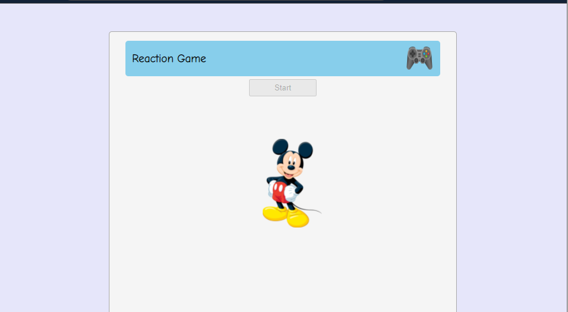

# Reaction_Game_Vue

This is a project that is made with vue.js. The aim of this project was to use different vue concept to make a reaction game. This is a light application allows user to play a small game to determine reaction speed.

## Game Rules

After clicking the start button an image of micky mouse will appear on the screen. User needs to click on the image as fast as possible to get the best score. Based on the reaction time ranking will appear on the screen.

</h1>Additional description about the project and its features.</h1>

<h2>Built With</h2>

- Vue Js
- Css
- Vscode

<h2>Live Demo</h2>
https://reaction-mouse.netlify.app/

<h2>Getting Started</h2>
To get a local copy up and running follow these simple example steps.

Clone the repository and get the files in your local branch. Use it according
to your convenience.

Prerequisites
Text editor,Github profile and Git.

<h2>Authors</h2>

👤 Author1

Github:
@ajkacca457

Twitter:
@ajkacca

Linkedin:
https://www.linkedin.com/in/avijit-karmaker-8738a54a/

🤝 <h2>Contribution</h2>
Contributions, issues and feature requests are welcome!

Feel free to check the issues page.

Show your support
Give a ⭐️ if you like this project!

## Acknowledgement

Project is inspired from Net Ninja youtube channel.
